## Hi My Name is Punya A. Gandhi 
- 🎨 Exhibiting Artist @ Stoutsberg Sourland African American Art Museum
- 🌍 Public Speaker @ Toastmasters YLP
- 🥋 Martial Artist @ Amerikick Martial Arts
- 🔧 Mechanical & Entrepreneurship @ FRC 293; FMA
- 👀 Founder of IVISYX

## 🚀 About Me
- 🔭 Researching, Creating Startups, and Paving my own Path.
- 🌱 Getting Ready for AAAI, IEEE, ISEF, STS, BOC, etc. 
- 📫 How to reach me: gandhi.punya@gmail.com
- SOME REPOS ARE ON PRIVATE! Contact me for further clarification/info. Will GLADLY share to an extent


## Custom Contribution Map 😝
<div align="center">

</div>

## Who Am I - 😎
<div align="center">
<table>
  <tr>
    <td valign="top"></td>
    <td valign="top"></td>
  </tr>
</table>
</div>

[](https://www.linkedin.com/in/punyagandhi/) [](mailto:gandhi.punya@gmail.com) [](https://github.com/punyagandhi?tab=followers)

## Technical Skills
A good portion of these are languages, and platforms that I have used for a good amount of projects and some of my hobbies. There are also some that I have used once or twice (familiar with), to build small personal projects. There is a good portion of my projects that arent listed in my repos. If you ever need help with a personal project want to look into some of mine, feel free to send me a text/email/dm. I love marketing for my brand IVISYX, and following trends while maintaining a technical/mechanical standpoint, so I am pretty active on all the platforms ive stated. ex: linkedin, discord, gmail, X(prv. Twitter), Reddit, Instagram, Whatsapp.


## punyagandhi.js ---- Tenacity💪
the drive and beggining of it all, what objectively defines me and what I'm currently working on, and trying to improve. People make mistakes, but the biggest one is not learning from them. I personally believe that people never chose to be born, and they dont choose to die. But to make the most out of what you have, and give it your 100% makes it all the more worthwile and meaningful. It also leaves, you saying, "oh well..", instead of, "what if.."
```js
const punya = {
  pronouns: ["he", "him", "his"],
  nationality: "Indian",
  code: ["C++", "Arduino", "React", "HTML", "CSS", "Python", "Java", "TypeScript"],
  tools: ["React", "Firebase", "Figma", "Supabase", "Convex"],
  researching: "Fatigue and the critical and general application of driving safety"
}
```
### 🔬 Research (Preprint - In-Progress)
- Fatigue detection & driving safety — [read the writeup →](https://doi.org/10.5281/zenodo.20558213)

## Traction💨
Recognition matters. Work good but Project yourself even better. No time like the present ;D. Put yourself out there if you haven't yet, however, random connections aren't eveyrthing, what really matters is the meaningful long term relationships you build through experiences, hard work, grit, and effort."If everything was easy, courage would never be discovered."
- 

## Progress...📈
- The amount of progress ive made so far, including what I use the most. "Icarus threw his head back and smiled because he finally flew..." - Fiona. Track your progress, if you want to go ahead you have to keep up first. Before you start to run the first step is to walk, and before you walk the first step is to crawl. 


## Streaks!!!🔥
- try to stay as dedicated and consistent as possible but some updates take time... Make big edits to my repos frequently to manage everything hyperefficiently, let me know if you see any mistakes or inconsistencies in my public repos, I'll gladly work with you, and take advice. Harsh Criticism might hurt a lot sometimes, but oftentimes its the cold hard truth


## Contact Me!
will most likely reply back within 1-2 hours
- company email: ivisyx@gmail.com
- personal email: gandhi.punya@gmail.com
- Number: +1 609 516 6779 [](https://wa.me/16095166779) [](tel:+16095166779) [](sms:+16095166779) [](facetime:+16095166779)
  
